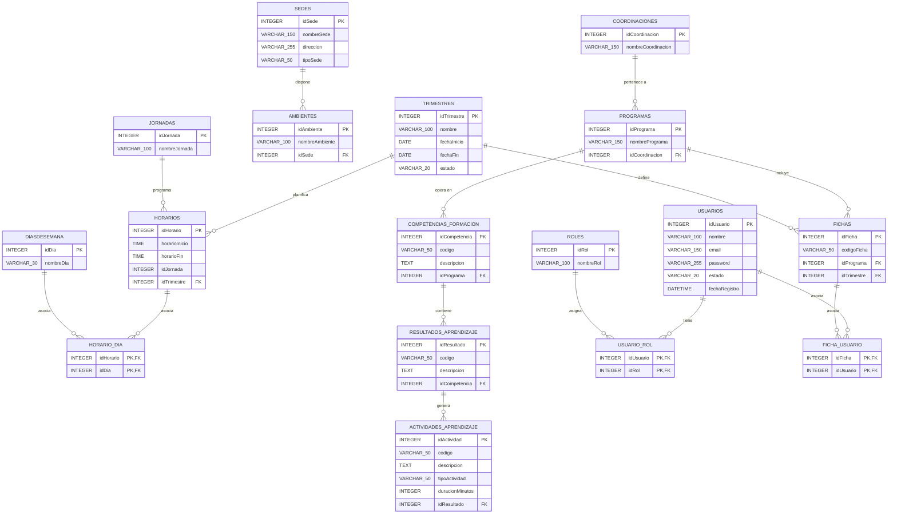

# MER SIHS

> Transcripción del modelo entidad-relación (MER) del archivo **MER SIHS.pdf**.
> El PDF está compuesto por una imagen, por lo que los nombres y tipos se transcribieron visualmente.

## Diagrama MER en Mermaid



## Entidades

### COORDINACIONES
| Campo | Tipo | Clave |
|---|---|---|
| idCoordinacion | Integer | PK |
| nombreCoordinacion | Varchar(150) | NOT NULL |

### PROGRAMAS
| Campo | Tipo | Clave |
|---|---|---|
| idPrograma | Integer | PK |
| nombrePrograma | Varchar(150) | NOT NULL |
| idCoordinacion | Integer | FK |

### TRIMESTRES
| Campo | Tipo | Clave |
|---|---|---|
| idTrimestre | Integer | PK |
| nombre | Varchar(100) | NOT NULL |
| fechaInicio | Date | NOT NULL |
| fechaFin | Date | NOT NULL |
| estado | Varchar(20) | NOT NULL |

### FICHAS
| Campo | Tipo | Clave |
|---|---|---|
| idFicha | Integer | PK |
| codigoFicha | Varchar(50) | NOT NULL |
| idPrograma | Integer | FK |
| idTrimestre | Integer | FK |

### SEDES
| Campo | Tipo | Clave |
|---|---|---|
| idSede | Integer | PK |
| nombreSede | Varchar(150) | NOT NULL |
| direccion | Varchar(255) | NOT NULL |
| tipoSede | Varchar(50) | NOT NULL |

### AMBIENTES
| Campo | Tipo | Clave |
|---|---|---|
| idAmbiente | Integer | PK |
| nombreAmbiente | Varchar(100) | NOT NULL |
| idSede | Integer | FK |

### JORNADAS
| Campo | Tipo | Clave |
|---|---|---|
| idJornada | Integer | PK |
| nombreJornada | Varchar(100) | NOT NULL |

### HORARIOS
| Campo | Tipo | Clave |
|---|---|---|
| idHorario | Integer | PK |
| horarioInicio | Time | NOT NULL |
| horarioFin | Time | NOT NULL |
| idJornada | Integer | NOT NULL |
| idTrimestre | Integer | FK |

### DIASDESEMANA
| Campo | Tipo | Clave |
|---|---|---|
| idDia | Integer | PK |
| nombreDia | Varchar(30) | NOT NULL |

### HORARIO_DIA
| Campo | Tipo | Clave |
|---|---|---|
| idHorario | Integer | PK, FK |
| idDia | Integer | PK, FK |

### USUARIOS
| Campo | Tipo | Clave |
|---|---|---|
| idUsuario | Integer | PK |
| nombre | Varchar(100) | NOT NULL |
| email | Varchar(150) | NOT NULL |
| password | Varchar(255) | NOT NULL |
| estado | Varchar(20) | NOT NULL |
| fechaRegistro | Datetime | NOT NULL |

### ROLES
| Campo | Tipo | Clave |
|---|---|---|
| idRol | Integer | PK |
| nombreRol | Varchar(100) | NOT NULL |

### USUARIO_ROL
| Campo | Tipo | Clave |
|---|---|---|
| idUsuario | Integer | PK, FK |
| idRol | Integer | PK, FK |

### FICHA_USUARIO
| Campo | Tipo | Clave |
|---|---|---|
| idFicha | Integer | PK, FK |
| idUsuario | Integer | PK, FK |

### COMPETENCIAS_FORMACION
| Campo | Tipo | Clave |
|---|---|---|
| idCompetencia | Integer | PK |
| codigo | Varchar(50) | NOT NULL |
| descripcion | Text | NOT NULL |
| idPrograma | Integer | FK |

### RESULTADOS_APRENDIZAJE
| Campo | Tipo | Clave |
|---|---|---|
| idResultado | Integer | PK |
| codigo | Varchar(50) | NOT NULL |
| descripcion | Text | NOT NULL |
| idCompetencia | Integer | FK |

### ACTIVIDADES_APRENDIZAJE
| Campo | Tipo | Clave |
|---|---|---|
| idActividad | Integer | PK |
| codigo | Varchar(50) | NOT NULL |
| descripcion | Text | NOT NULL |
| tipoActividad | Varchar(50) | NOT NULL |
| duracionMinutos | Integer | NOT NULL |
| idResultado | Integer | FK |
```

# Notas

- `PK` = clave primaria.
- `FK` = clave foránea.
- `NOT NULL` = campo obligatorio.
- El diagrama Mermaid reproduce las relaciones visibles en el PDF.
